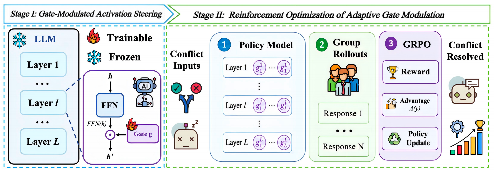
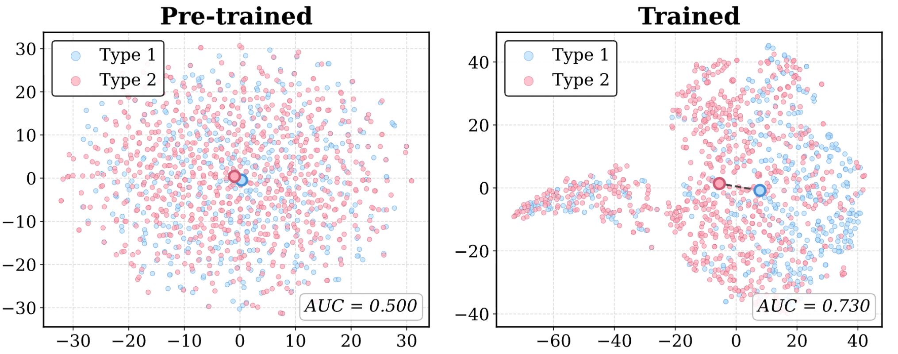
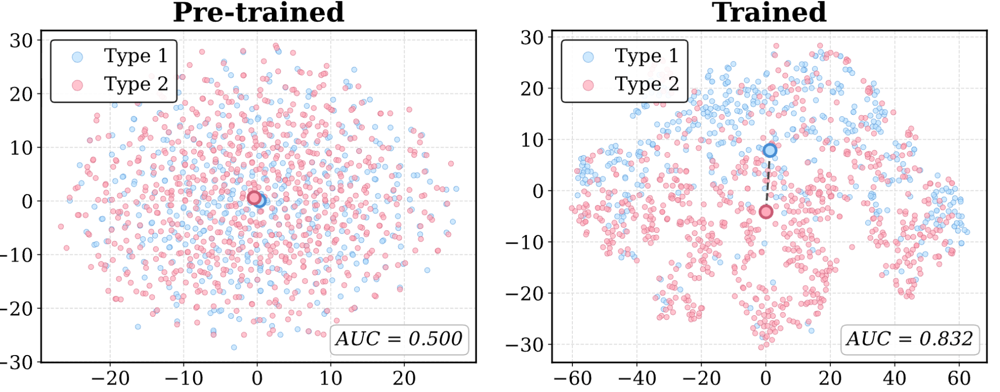

<!-- title -->
<div align="center">
<h1> SHIFT: Gate-Modulated Activation Steering for Knowledge Conflict Mitigation in Retrieval-Augmented Generation
<h5 align="center"> 


<!-- hyperlinks -->
<p align="center">
  <a href="https://github.com/OpenBMB/SHIFT" alt="GitHub">
    
  </a>
  <a href="#citation" alt="Paper">
    
  </a>
  <a href="https://huggingface.co/ITcoder/SHIFT" alt="Checkpoints">
    
  </a>
  <a href="LICENSE" alt="License">
    
  </a>
</p>


<!-- authors -->
Ruochang Li<sup>1*</sup>,
Pengcheng Huang<sup>1\*</sup>,
Zhenghao Liu<sup>1†</sup>,
Yukun Yan<sup>2</sup>,
</br>
Huiyuan Xie<sup>2</sup>,
Yu Gu<sup>1</sup>,
Ge Yu<sup>1</sup>,
Maosong Sun<sup>2</sup>

<sup>1</sup>Northeastern University, <sup>2</sup>Tsinghua University

</h5>
</div>


## 📖 Overview
<p align="center">
  
</p>

SHIFT is a lightweight framework for resolving knowledge conflicts in retrieval-augmented generation. Instead of directly editing internal neurons, SHIFT adds a small learnable gate module to frozen LLMs, allowing them to adaptively balance retrieved context and parametric knowledge during generation. With fewer than 0.01% trainable parameters, SHIFT improves context reliance while minimizing unintended effects on general model capabilities.


## ⚙️ Setup
1. Create Conda Environment
```bash
conda create --name shift python==3.10.0
conda activate shift
git clone https://github.com/OpenBMB/SHIFT.git
cd SHIFT
```
2. Install PyTorch
```
pip install torch==2.6.0 --index-url https://download.pytorch.org/whl/cu124
```
3. Install Flash Attention
```
pip install https://github.com/Dao-AILab/flash-attention/releases/download/v2.7.4.post1/flash_attn-2.7.4.post1+cu12torch2.6cxx11abiFALSE-cp310-cp310-linux_x86_64.whl
```
4. Install the rest of the dependencies:
```
pip install -r requirements.txt
```
5. Patch vLLM model files  
This project requires modifications to the vLLM implementations of Qwen3 and LLaMA.
After installing the requirements, run the patch script:
```
bash vllm/patch_vllm.sh
```
> Note: Please run this script after 'pip install -r requirements.', because installing or reinstalling vLLM may overwrite the patched files.

### ⚡ Data

Our training data can be downloaded from [SHIFT](https://huggingface.co/datasets/ITcoder/SHIFT_Training_Data). After downloading, place the files into the dataset folder.


To construct the data from scratch, download the files from [MRQA-Shared-Task-2019](https://github.com/mrqa/MRQA-Shared-Task-2019).  
Use the downloaded data to synthesize it with [FlashRAG](https://github.com/RUC-NLPIR/FlashRAG).


### 🔥 Training
GRPO with a single GPU: 
```
python single_gpu.py
```
GRPO with multiple GPUs:
```
python multi_gpu.py
```


### 📊 Evaluation
For MRQA and ConfiQA: 
```
python eval.py
```
For MMLU, use [lm-evaluation-harness](https://github.com/EleutherAI/lm-evaluation-harness)


### 🎯 Analysis
We also provide the t-SNE visualization pipeline for gates in SHIFT, with corresponding figures available under the figs folder:
```
python run_batch_tsne.py
```

For Qwen-3-0.6B: 
<p align="center">
  
</p>
For Qwen-3-8B:
<p align="center">
  
</p>


### 🎉 Acknowledgement 
Our work is built on the following codebases, and we are deeply grateful for their contributions.
- [vllm](https://github.com/vllm-project/vllm)
- [nano-aha-moment](https://github.com/McGill-NLP/nano-aha-moment)
- [lm-evaluation-harness](https://github.com/EleutherAI/lm-evaluation-harness)
- [gated_attention](https://github.com/qiuzh20/gated_attention)
- [FlashRAG](https://github.com/RUC-NLPIR/FlashRAG)
  


### 🥰 Citation
If you find this work useful, please cite our paper and give us a shining star 🌟
```bibtex
@article{Li2026shift,
      title={SHIFT: Gate-Modulated Activation Steering for Knowledge Conflict Mitigation in Retrieval-Augmented Generation},
      author={Li, Ruochang and Huang, Pengcheng and Liu, Zhenghao and Yan, Yukun and Xie, Huiyuan and Gu, Yu and Yu, Ge and Sun, Maosong},
      year={2026}
      url={}, 
}
```


### 📧 Contact
If you have questions, collaboration opportunities, or potential PhD opportunities in the United States, please feel free to email:
```
li.draco.neu@gmail.com
```

